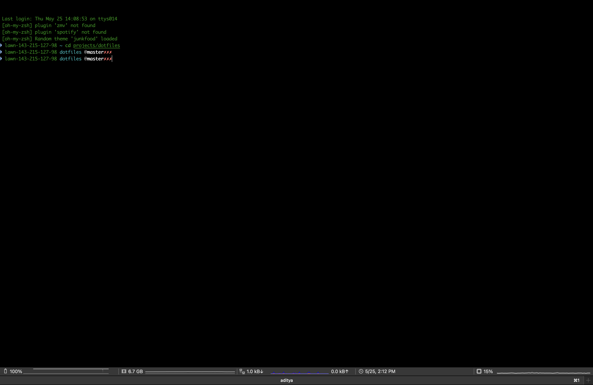

# Aditya's dotfiles

Collection of customizations across iterm, tmux, git, shell, and debugging utilities that I've found useful and use actively.

## Iterm

Here's an image of a the customized iterm window (I have customized the theme, font and the toolbar to show additional system information)

## Setting up a new server

To setup dotfiles run the following scripts and you're good to go

1. `sh copy_dotfiles.sh`

2. To setup zsh run `sh setup_zsh.sh` (Highly recommended)
